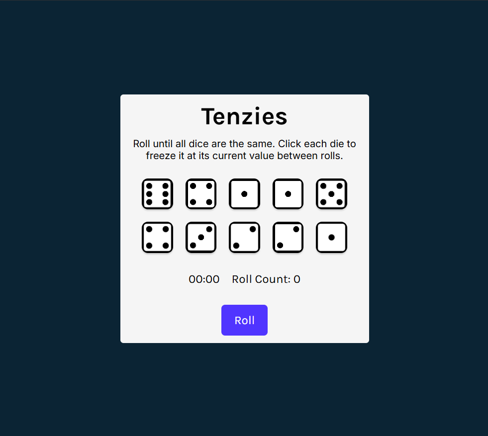
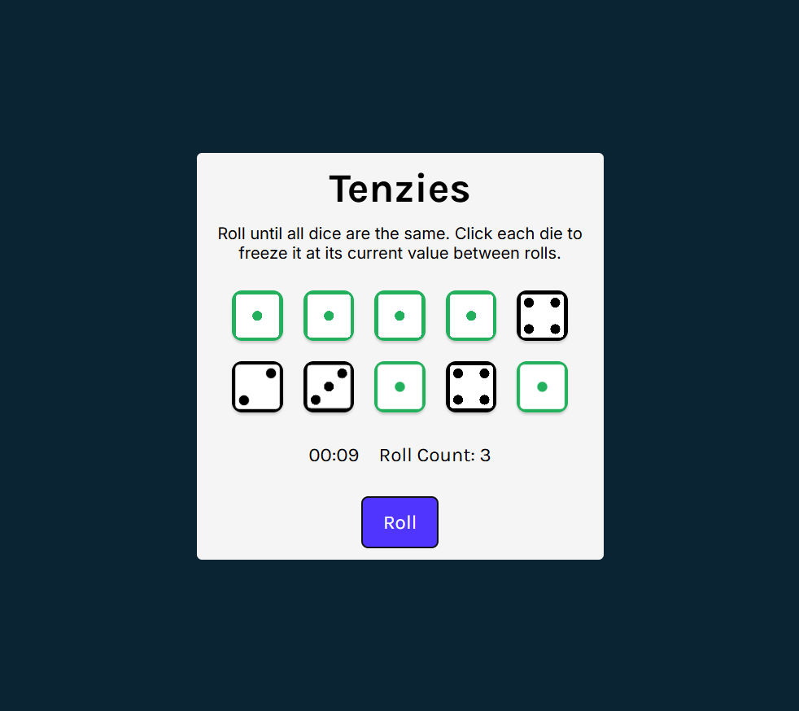
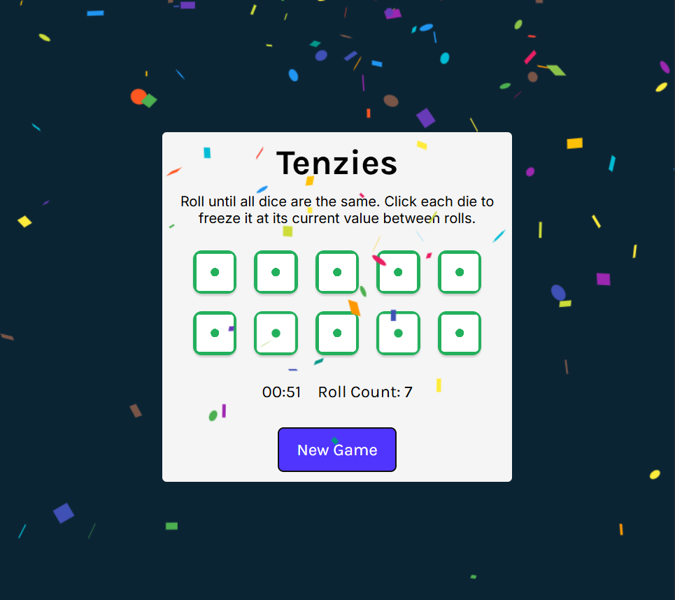

# Tenzies
A simple implementation of a game of tenzies, built on the React library. The players are encouraged to get 10 dice of same pip values as fast as possible and with as little re-roll as possible.

Visit the implementation here: https://tenzies-dhz4.onrender.com/

<div align='center'>
    
    
    
</div>


## Key takeaways
1. How to properly setup and clear the time interval in React

    * IMPORTANT
        - Do not set `now` as a state variable
        - This is because when setInterval is called to setup the action update at 1000ms interval, it will only refer to the value stored in the address of the current `now`
        - If `now` is a state, everytime this components get re-rendered, `now` will be saved to a new address.
        - However, setInterval still refer to the old address, using the old value. (Since this function is only called once upon setup)
        - In fact, in this case, the current address of `now` is the initial value (which likely is 0 or value of previous rendering). The new value of `now` will only gets registered (at a new memory location) upon the next edition of rendering. Therefore, the `now` in setInterval never gets to refer to the latest value of `now`.


    ```js

    const [timeDiff, setTimeDiff] = useState(0)
    const [intervalUpdate, setIntervalUpdate] = useState(null)

    // Some condition to trigger this upon game start
    const now = new Date()
    setIntervalUpdate(setInterval(() => {
        setTimeDiff(new Date() - now)
        }, 1000))

    // Some condition to clear both the interval as well as the state that holds it
    setIntervalUpdate(prevIntervalUpdate => {
        clearInterval(prevIntervalUpdate)
        return null
      })
    
    ```
